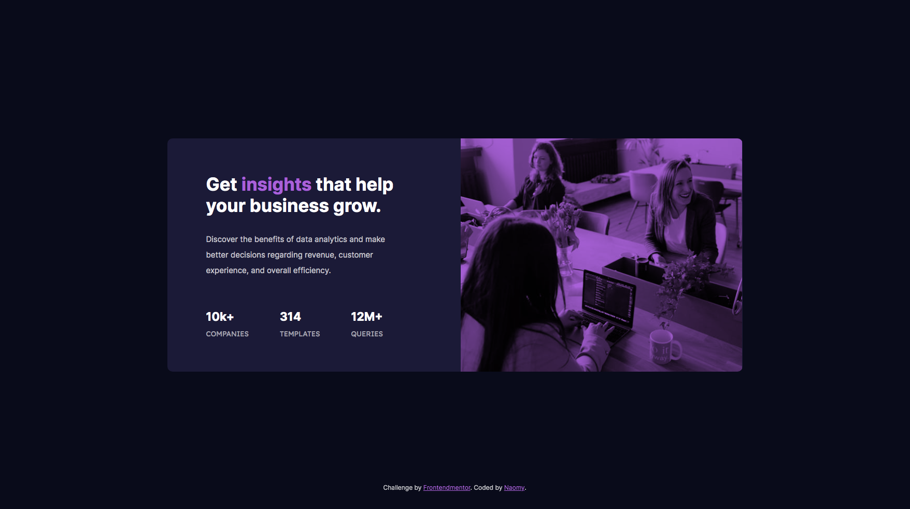

<h1 align="center">
   📈 <a href="#"> Stats preview card component </a>
</h1>

<h3 align="center">
    Frontend Mentor - Stats preview card component solution
</h3>

  
    
<!--     -->

<h4 align="center"> 
	 Status: Finished
</h4>

 <a href="#about">About</a> •
 <a href="#features">Features</a> •
 <a href="#layout">Layout</a> • 
 <a href="#author">Author</a> 
<!--  <a href="#user-content-license">License</a>
 -->

## About

This is a solution to the [Stats preview card component challenge on Frontend Mentor](https://www.frontendmentor.io/challenges/stats-preview-card-component-8JqbgoU62). Frontend Mentor challenges help you improve your coding skills by building realistic projects.

Built with
- Semantic HTML5 markup
- CSS custom properties
- Flexbox

Solution URL: [My solutioin](https://naomy19.github.io/Stats-preview-card-component/)

---

## Features

- [x] User view the optimal layout depending on their device's screen size

---

## Layout

  

---

### What I learned

Through this project I could practice what I have learned about HTML (sections and divs), CSS (flexbox) and responsive design.
Also, I could learn about background-blend-mode.

---

### Continued development

I will continue to practice flexbox, position and widths/heights.

---

### Useful resources

- [Cole Steele's videos](https://www.youtube.com/watch?v=SF_Xl5TOGlY&list=PLblA84xge2_xNtaFnZhefjFbnDrpySKD3) - I highly recommend Cole Steele videos, this is the link for a playlist "Learn Code from Scratch". His videos helped understand more about CSS (flexbox, units and media queries).

---

## How to contribute

1. Fork the project.
2. Create a new branch with your changes: `git checkout -b my-feature`
3. Save your changes and create a commit message telling you what you did: `git commit -m" feature: My new feature "`
4. Submit your changes: `git push origin my-feature`
> If you have any questions check this [guide on how to contribute](./CONTRIBUTING.md)

---

## Author

- Frontend Mentor - [@naomy19](https://www.frontendmentor.io/profile/naomy19)

<a href="https://github.com/naomy19">
 
  
 <b>Camilla Naomy Tsuda</b></a> 
  

 

---

<!-- ## License

This project is under the license [MIT](./LICENSE).

Made with love by  👋🏽 [Get in Touch!]() -->
<!-- 
--- -->
